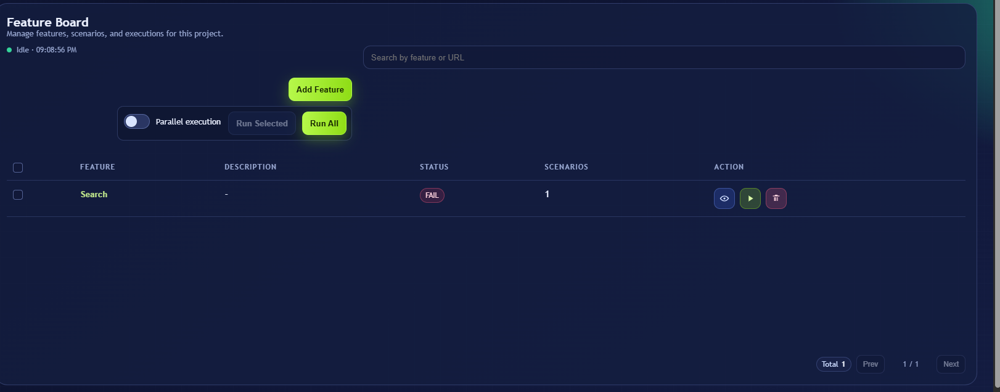

# BlackDrongo

BlackDrongo is a local automation product for authoring, generating, and running UI tests from a web interface.

It combines:

- a Selenium framework (`blackdrongo-selenium`)
- a Playwright framework (`blackdrongo-playwright`)
- a Spring Boot orchestration UI (`blackdrongo-ui-generator`)
- an optional AI service for draft generation and healing (`blackdrongo-ai-service`)

## Product Goal

BlackDrongo helps users do this flow end-to-end:

1. Create a Project in the UI (engine, browser, base setup).
2. Add Features and Scenarios in plain language.
3. Generate runnable automation scaffolding.
4. Execute builds now or on schedule.
5. View pass/fail status and execution history from the same UI.
6. Optionally use AI to accelerate scenario drafting and healing suggestions.

## Monorepo Structure

- `blackdrongo-selenium`: reusable Selenium + TestNG + Cucumber framework.
- `blackdrongo-playwright`: reusable Playwright + TestNG + Cucumber framework.
- `blackdrongo-ui-generator`: Spring Boot UI and orchestration engine.
- `blackdrongo-ai-service`: FastAPI service for AI generation/healing APIs.
- `docs/images`: documentation assets (UI snapshots used in this README).

## Architecture At A Glance

- UI Generator persists product data in SQLite.
- UI Generator generates runnable project workspaces under `blackdrongo-ui-generator/generated/`.
- Build execution is isolated per run/scenario workspace and cleaned up after execution.
- Selenium and Playwright modules are installed/used as framework dependencies for generated projects.
- AI service is optional and called by UI Generator when AI features are used.

## Prerequisites

- Java JDK 25 (repo-wide Maven parent is set to Java 25).
- Maven 3.9+.
- Python 3.10+ (for AI service only).
- Windows/macOS/Linux local environment with browser dependencies.

## Run Everything Locally

### 1) Build modules

```bash
mvn -DskipTests compile
```

### 2) Start UI Generator

```bash
cd blackdrongo-ui-generator
mvn spring-boot:run
```

UI defaults:

- URL: `http://127.0.0.1:8085`
- Login user: `admin` (or `BLACKDRONGO_UI_USER`)
- Login password: `change-this-immediately` (or `BLACKDRONGO_UI_PASSWORD`)

Reference: `blackdrongo-ui-generator/src/main/resources/application.properties`

### 3) Start AI Service (optional)

```bash
cd blackdrongo-ai-service
python -m venv .venv
.venv\Scripts\activate
pip install -r requirements.txt
uvicorn app.main:app --reload --port 8001
```

## Typical End-User Workflow In UI

### Create project

1. Open `Projects` from sidebar.
2. Click `Create Project`.
3. Choose engine (`selenium` or `playwright`) and browser.
4. Save.

### Add feature

1. Open project -> `Features`.
2. Click `Add Feature`.
3. Enter feature name, description, base URL, Jira stories (optional).

### Add scenario

1. Expand a feature row.
2. Click `Create Scenario`.
3. Enter scenario name, tags, and step text.
4. Save.

### Execute

1. Use `Run All`, `Run Selected`, or go to `Create Build`.
2. For builds, choose target type:
    - Project-wide
    - Selected features
    - Selected scenarios
    - Tags
3. Run now or schedule.
4. Track status in `Running Builds` and `Build History`.

## Scenario Writing Examples For UI Users

In the scenario editor text area, users should write readable step intent.

Example 1:

```gherkin
Given I open https://example.com/login
When I enter "user@example.com" in email
And I enter "Pass@123" in password
And I click Login
Then I should see "Dashboard"
```

Example 2:

```gherkin
Given I open the application
When I search for "laptop"
And I click Search
Then I should see "Results"
```

Guidelines for better generated output:

- Keep one intent per line.
- Use explicit target names (`Login button`, `Email field`).
- Put data values in quotes.
- Add tags like `@smoke`, `@regression` for build targeting.

### Passing Locators In Scenario Text

When authoring scenarios in the UI, you can pass an explicit locator by appending `|` and locator text in the same step
line.

Format:

```text
<gherkin step text> | <locator>
```

Examples:

```gherkin
When I click Login | id=login-btn
And I enter "user@example.com" in email | css=input[name='email']
And I enter "Pass@123" in password | xpath=//input[@type='password']
Then I should see "Dashboard" | text=Dashboard
```

Notes:

- If `| locator` is omitted, the generator falls back to heuristic locator generation from step text.
- Supported prefixes include `id=`, `name=`, `css=`, `xpath=`, `text=`, `label=`, and `role=...`.
- Playwright role options are supported, for example:
  `role=button|name=Login|exact=true`

## UI Snapshot

Feature Board example:



## Playwright Step Locator Usage

Playwright automation uses `playwright.steps.Step` with locator strings.

Basic usage:

```java
Step.create()
    .setWebElement("role=button|name=Login")
    .click();
```

Supported locator formats:

- `css=.login-btn`
- `xpath=//button[@type='submit']`
- `id=username`
- `name=password`
- `label=Email`
- `role=button|name=Search`
- plain text fallback: `Search` (uses `getByText(...).first()`)

Role locator options:

- `name`
- `exact`
- `checked`
- `disabled`
- `expanded`
- `pressed`
- `selected`
- `includeHidden`
- `level`
- `index`

Role examples:

```text
role=button|name=Add to cart|exact=true
role=heading|level=2|name=Checkout
role=button|name=Search|index=0
```

## Build And Test Commands

- Build all modules: `mvn -DskipTests compile`
- Compile test sources all modules: `mvn -DskipTests test-compile`
- Selenium tests: `mvn -f blackdrongo-selenium/pom.xml test`
- Playwright tests: `mvn -f blackdrongo-playwright/pom.xml test`
- UI Generator compile only: `mvn -f blackdrongo-ui-generator/pom.xml -DskipTests compile`

## API/Runtime Endpoints

UI Generator:

- `/login`
- `/projects`
- `/projects/new`
- `/running-tests`
- `/builds/new`
- `/builds/history`

AI Service:

- `GET /health`
- `POST /api/v1/generate/tests`
- `POST /api/v1/heal/failure`

## Data And Generated Artifacts

- UI Generator DB: SQLite (managed by app runtime).
- Generated projects: `blackdrongo-ui-generator/generated/`.
- Build/runtime records: tracked in UI pages and DB tables.
- AI history: `blackdrongo-ai-service/data/history/*.jsonl`.

## Troubleshooting

- If UI does not start on `8085`, check `ui-generator.out.log` and `ui-generator.err.log`.
- If login fails, verify `BLACKDRONGO_UI_USER` and `BLACKDRONGO_UI_PASSWORD`.
- If AI calls fail, ensure AI service is up on `127.0.0.1:8001`.
- If browser launch fails in Playwright, confirm local browser/channel availability.
- If generated tests fail immediately, inspect locator quality and scenario phrasing.
